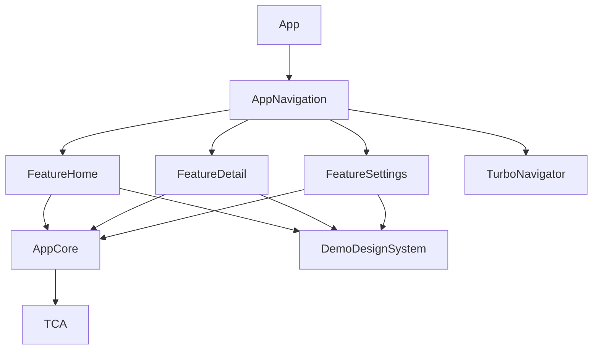

# SwiftUITCATurboModularDemo

[TCA 1.26.1](https://github.com/pointfreeco/swift-composable-architecture/releases/tag/1.26.1), 모듈러 아키텍처, `TurboNavigator`를 함께 사용하는 iOS 예제 프로젝트입니다.

각 Feature는 TCA의 state, action, reducer, SwiftUI view만 소유합니다. 실제 화면 전환은 `AppNavigation`이 `DemoNavigationClient`를 `TurboNavigator` 명령으로 연결해 처리합니다.

## 실행 방법

이 예제는 Tuist `4.197.0`, Xcode `26.4`, Swift `6.3`에서 검증했습니다.

```bash
tuist generate --path Demo/SwiftUITCATurboModularDemo --no-open
open Demo/SwiftUITCATurboModularDemo/SwiftUITCATurboModularDemo.xcworkspace
```

명령줄에서 빌드하려면 다음 명령을 실행합니다.

```bash
xcodebuild \
  -workspace Demo/SwiftUITCATurboModularDemo/SwiftUITCATurboModularDemo.xcworkspace \
  -scheme SwiftUITCATurboModularDemo \
  -destination 'generic/platform=iOS Simulator' \
  -skipMacroValidation \
  CODE_SIGNING_ALLOWED=NO \
  build
```

Xcode에서 처음 실행할 때는 TCA의 Swift Macro 사용을 승인해 주셔야 합니다. `-skipMacroValidation`은 비대화형 명령줄 빌드에서 승인 대화상자를 생략하기 위한 옵션입니다.

## 테스트

### 리듀서 단위 테스트

`FeatureHome` scheme에는 navigation dependency를 대역으로 교체하는 TCA `TestStore` 테스트가 포함되어 있습니다. 이 테스트는 사용자 액션이 올바른 navigation 명령을 요청하는지 확인합니다.

```bash
xcodebuild \
  -workspace Demo/SwiftUITCATurboModularDemo/SwiftUITCATurboModularDemo.xcworkspace \
  -scheme FeatureHome \
  -destination 'platform=iOS Simulator,name=iPhone 16 Pro Max' \
  -skipMacroValidation \
  CODE_SIGNING_ALLOWED=NO \
  test
```

### 화면 전환 통합 테스트

앱 scheme의 UI 테스트는 TCA 액션에서 시작해 `DemoNavigationClient`, `AppNavigation`, `TurboNavigator`, UIKit 화면 계층으로 이어지는 전체 경로를 검증합니다. 다음 동작을 실제 시뮬레이터에서 확인합니다.

- stack push, 연속 push, 루트 복귀, stack replace
- modal 표시, modal 내부 push와 pop, modal root dismiss

```bash
xcodebuild \
  -workspace Demo/SwiftUITCATurboModularDemo/SwiftUITCATurboModularDemo.xcworkspace \
  -scheme SwiftUITCATurboModularDemo \
  -destination 'platform=iOS Simulator,name=iPhone 16 Pro Max' \
  -skipMacroValidation \
  -only-testing:SwiftUITCATurboModularDemoUITests \
  test
```

설치된 시뮬레이터 이름이 다르면 `-destination` 값만 바꿔 실행해 주세요. UI 테스트 명령에는 `-sdk iphonesimulator`를 추가하지 마세요. Swift Package의 매크로 실행 파일까지 시뮬레이터용으로 빌드되어 실행에 실패할 수 있습니다.

## 모듈 구성

| 모듈 | 역할 |
| --- | --- |
| `AppCore` | 공유 route, repository, TCA 공개 경계와 navigation dependency를 정의합니다. |
| `DemoDesignSystem` | Feature가 함께 사용하는 화면 레이아웃과 버튼을 제공합니다. |
| `FeatureHome` | stack, modal, replace 동작을 실행하는 TCA Feature입니다. |
| `FeatureDetail` | 연관값 route를 state로 받고 다음 화면 전환을 실행합니다. |
| `FeatureSettings` | push stack과 modal stack에서 재사용되는 TCA Feature입니다. |
| `AppNavigation` | `RouteRegistry`, TCA Store, `TurboNavigator` adapter를 조립합니다. |
| `App` | `AppRootView`를 실행하는 composition root입니다. |
| `App/UITests` | TCA 액션부터 실제 UIKit 화면 전환까지 통합 검증합니다. |

## 의존성 방향



TCA는 `AppCore`, `TurboNavigator`는 `AppNavigation`에서만 직접 연결합니다. Feature 모듈은 `TurboNavigator`나 UIKit을 import하지 않으므로, reducer 테스트에서는 실제 화면 계층 없이 `DemoNavigationClient`만 교체해 navigation 결과를 검증할 수 있습니다.

## 확인할 수 있는 동작

- 단일 route와 여러 route push
- route 배열을 사용한 stack replace
- modal과 full-screen modal 표시
- `back`, `backTo`, `backOrPush`
- 현재 route stack을 TCA state에 반영
- 동일한 Feature를 push stack과 modal stack에서 재사용
