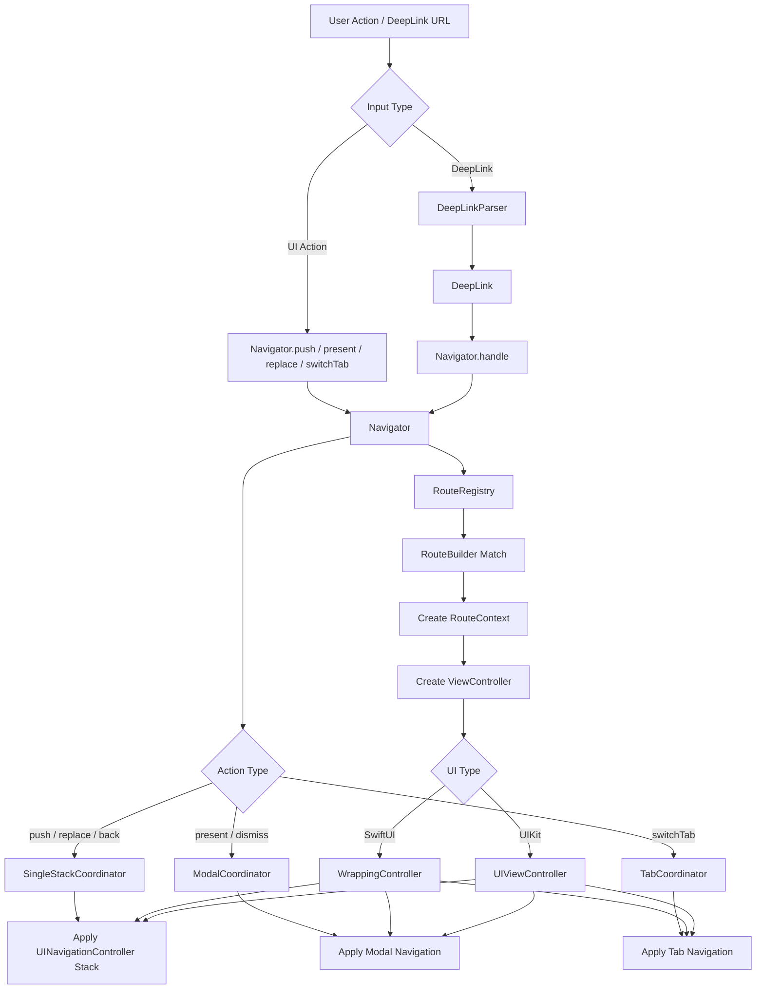

<!--  -->
[한국어](./README.md) | [English](./README.en.md)

# Example
|  |  |  |  |  |
|:---:|:---:|:---:|:---:|:---:|
| push(A) | push([A, B]) | present | presentFullScreen | DeepLink |

# TurboNavigator

`TurboNavigator` is a typed route-based navigation library powered by `UINavigationController`.
It lets you build screens with SwiftUI while keeping actual navigation control explicit on top of UIKit stack, tab, and modal flows.

## Platform

- Minimum deployment target: `iOS 13`
- UI layer: `SwiftUI`
- Navigation engine: `UIKit`

## Why a UIKit-powered engine?

`NavigationStack` is great for declarative path modeling, but it becomes awkward when you want to manage the kinds of flows real apps often need from one place.

- You constantly need to care about whether a push should happen on the root stack, a tab stack, or above a modal.
- Imperative controls like `backTo`, `backOrPush`, `replace`, or returning to root when reselecting the same tab tend to get scattered across the app.
- `stack`, `tab`, `modal`, and `deep link` flows often end up with different calling conventions, making them harder to treat as one system.
- Even when screens are written cleanly in SwiftUI, complex screen transitions usually still need a separate control layer.

`TurboNavigator` addresses that gap by letting SwiftUI focus on screens while UIKit remains the navigation engine.

### Strengths

- Unifies `stack`, `tab`, `modal`, and `deep link` flows behind one `Navigator` API.
- `Navigator` decides whether the current active target is the root stack, tab stack, or modal stack, which keeps call sites simpler.
- Imperative operations like `backTo`, `backOrPush`, `replace`, and `switchTab` all follow the same calling style.
- `enum`-based routes and explicit dependency injection create a type-safe, traceable navigation setup.
- SwiftUI stays focused on screen composition while the UIKit engine handles complex transitions.
- The design is not tied only to newer APIs such as `NavigationStack`, so it can still support `iOS 13`.

### Core pieces

- `Navigator`
  - Main entry point for push, replace, back, modal, and tab transitions
- `RouteRegistry`
  - Registry where each route is mapped to a screen builder
- `RouteContext`
  - Execution context passed into builders, containing `route`, `navigator`, and `dependencies`
- `NavigationContainer` / `TabNavigationContainer`
  - SwiftUI bridges that host the UIKit navigation engine
- `DeepLinkParser`
  - Protocol that converts a URL into a typed route-based deep link

<br/><br/>

## Current status

- Implemented: typed route-based `Navigator`, `RouteRegistry`, explicit DI, stack/modal/tab operations, deep link entry point, SwiftUI bridge, demo app
- Lower priority: generalized nested modal handling, `remove`-style operations, default deep link parser implementation, state restoration, expanded UIKit-only examples

## Installation

### Swift Package Manager

Xcode:

1. `File > Add Package Dependencies...`
2. Enter the repository URL
3. Choose the version / branch / commit you want
4. Link `TurboNavigator` to your app target

Local package:

1. `File > Add Package Dependencies...`
2. Select `Add Local...`
3. Choose the folder that contains `TurboNavigator/Package.swift`

Add it directly from `Package.swift`:

```swift
dependencies: [
  .package(url: "https://github.com/indextrown/TurboNavigator.git", from: "1.0.0")
]
```

```swift
targets: [
  .target(
    name: "YourApp",
    dependencies: [
      .product(name: "TurboNavigator", package: "TurboNavigator")
    ])
]
```

For the public repository, use `https://github.com/indextrown/TurboNavigator.git` with `from: "1.0.0"`.
If you are developing the app and package together locally, the local package option is the fastest.

## Quick Start

Follow these steps for a first integration.

### 1. Define routes

```swift
enum AppRoute: Hashable {
  case home
  case detail(id: String)
  case settings
}
```

### 2. Define dependencies

```swift
struct AppDependencies {
  let userRepository: UserRepository
  let analytics: AnalyticsClient
}
```

### 3. Build the `RouteRegistry`

```swift
let registry = RouteRegistry<AppDependencies, AppRoute>()
  .registering(.home) { context in
    // In a UIKit-only project, you can return a UIViewController directly
    // instead of using WrappingController.
    WrappingController(route: context.route, title: "Home") {
      HomeView(navigator: context.navigator)
    }
  }
  .registering(
    extracting: { (route: AppRoute) -> String? in
      guard case let .detail(id) = route else { return nil }
      return id
    },
    build: { context, id in
      WrappingController(route: context.route, title: "Detail") {
        DetailView(
          userID: id,
          repository: context.dependencies.userRepository,
          navigator: context.navigator)
      }
    })
  .registering(.settings) { context in
    WrappingController(route: context.route, title: "Settings") {
      SettingsView(navigator: context.navigator)
    }
  }
```

### 4. Create a `Navigator`

```swift
let navigator = Navigator(
  dependencies: AppDependencies(
    userRepository: DefaultUserRepository(),
    analytics: DefaultAnalyticsClient()),
  registry: registry
)
```

### 5. Connect it to SwiftUI

Single stack app:

```swift
NavigationContainer(
  navigator: navigator,
  initialRoutes: [.home],
  prefersLargeTitles: true
)
```

Tab-based app:

```swift
TabNavigationContainer(
  navigator: navigator,
  items: [
    .init(
      tag: 0,
      route: .home,
      tabBarItem: UITabBarItem(title: "Home", image: nil, tag: 0)),
    .init(
      tag: 1,
      route: .settings,
      tabBarItem: UITabBarItem(title: "Settings", image: nil, tag: 1))
  ]
)
```

### 6. Call it from screens

```swift
navigator.push(.detail(id: "42"))
navigator.present(.settings)
navigator.presentFullScreen(.settings)
navigator.back()
navigator.switchTab(tag: 1)
```

### 7. Hook up deep links

```swift
struct AppDeepLinkParser: DeepLinkParser {
  func parse(url: URL) -> DeepLink<AppRoute>? {
    guard let components = URLComponents(url: url, resolvingAgainstBaseURL: false) else {
      return nil
    }

    switch components.host {
    case "home":
      return DeepLink(route: .home, action: .replace)
    case "settings":
      return DeepLink(route: .settings, action: .present(style: .fullScreen))
    case "detail":
      let id = components.queryItems?.first(where: { $0.name == "id" })?.value ?? ""
      guard !id.isEmpty else { return nil }
      return DeepLink(route: .detail(id: id), action: .push)
    default:
      return nil
    }
  }
}
```

```swift
.onOpenURL { url in
  navigator.handle(url: url, parser: AppDeepLinkParser())
}
```

Example URLs:

- `turbonavigator://home`
- `turbonavigator://detail?id=42`
- `turbonavigator://settings`

## Usage notes

- Routes can mix fixed cases like `.home` with associated-value cases like `.detail(id:)`.
- Gather external dependencies in `Dependencies`, then access them inside builders through `context.dependencies`.
- Register fixed routes with `registering(_:)` and associated-value routes with `registering(extracting:)`.
- Screens do not need to manipulate `UIViewController` directly; they can just call `navigator`.
- For deep links, the app receives the URL, the parser converts it into `DeepLink<Route>`, and `navigator.handle(url:parser:)` executes it.

## Adoption checklist

1. Did you define `AppRoute`?
2. Did you define `AppDependencies`?
3. Did you register screens in `RouteRegistry`?
4. Did you create a `Navigator`?
5. Did you connect `NavigationContainer` or `TabNavigationContainer`?
6. Are your screens calling `navigator.push/present/back`?

## Supported operations

The time complexity below is an approximate cost based on the current implementation.

- `B`: number of registered `RouteBuilder`s
- `S`: length of the currently active `UINavigationController` stack
- `R`: number of routes passed at once
- `P`: parser cost implemented by the app
- `A`: execution cost of the parsed action

- Stack: `push`, `replace`, `back`, `backTo`, `backOrPush`, `currentRoutes`
- Modal: `present`, `presentFullScreen`, `dismissModal`
- Tab: `switchTab`
- Deep Link: `handle(_:)`, `handle(url:parser:)`

### Stack

- `push(_ route:)`: `O(B + S)`
- `push(_ routes:)`: `O(R * B + (S + R))`
- `replace(with:)`: `O(R * B + R)`
- `back()`: `O(1)`
- `backTo(_ route:)`: `O(S)`
- `backOrPush(_ route:)`: `O(S)` if the route exists, otherwise `O(S + B)`
- `currentRoutes()`: `O(S)`

### Modal

- `present(_ route:)`: `O(B)`
- `present(_ routes:)`: `O(R * B + R)`
- `presentFullScreen(_ route:)`: `O(B)`
- `presentFullScreen(_ routes:)`: `O(R * B + R)`
- `dismissModal()`: `O(1)`
- `isModalActive`: `O(1)`

### Tab

- `switchTab(tag:)`: `O(1)`
- `switchTab(tag:popToRootIfSelected:)`: `O(1)` for a normal tab switch, `O(S)` when reselecting the same tab and popping to root

### Deep Link

- `handle(_ deepLink:)`: follows the same cost as `push`, `replace`, or `present`, depending on the deep link action
- `handle(url:parser:)`: `O(P + A)`

Policies:

- Each tab owns its own `UINavigationController`.
- Only one modal layer is kept at a time, and presenting a new modal replaces the existing modal.
- If a modal is active, its modal stack becomes the current active stack.
- Deep link parsing is handled by the app, while the navigator executes the parsed action.

## Architecture


<!-- ## Sample app

Recommended files to inspect first:

- Entry point: [TurboNavigatorDemoApp.swift](/Users/kimdonghyeon/2025/개발/라이브러리/TurboNavigator/Demo/TurboNavigatorDemo/TurboNavigatorDemo/TurboNavigatorDemoApp.swift)
- Routing composition: [AppDelegate.swift](/Users/kimdonghyeon/2025/개발/라이브러리/TurboNavigator/Demo/TurboNavigatorDemo/TurboNavigatorDemo/AppDelegate.swift)
- Home test screen: [HomeView.swift](/Users/kimdonghyeon/2025/개발/라이브러리/TurboNavigator/Demo/TurboNavigatorDemo/TurboNavigatorDemo/View/HomeView.swift)
- Detail test screen: [DetailView.swift](/Users/kimdonghyeon/2025/개발/라이브러리/TurboNavigator/Demo/TurboNavigatorDemo/TurboNavigatorDemo/View/DetailView.swift)
- MVVM sample screen: [MVVMSampleView.swift](/Users/kimdonghyeon/2025/개발/라이브러리/TurboNavigator/Demo/TurboNavigatorDemo/TurboNavigatorDemo/View/MVVMSampleView.swift)
- Settings test screen: [SettingView.swift](/Users/kimdonghyeon/2025/개발/라이브러리/TurboNavigator/Demo/TurboNavigatorDemo/TurboNavigatorDemo/View/SettingView.swift)
- Xcode project: [TurboNavigatorDemo.xcodeproj](/Users/kimdonghyeon/2025/개발/라이브러리/TurboNavigator/Demo/TurboNavigatorDemo/TurboNavigatorDemo.xcodeproj)

`TurboNavigatorDemo` is not just a showcase app, but an operation-testing sample.

`MVVMSampleView` also demonstrates a setup where the view does not own its state directly, and `MVVMSampleViewModel` manages state and navigation actions as an `ObservableObject`. You can try it from the `Push MVVM Sample` and `Present MVVM Sample` buttons on the home screen.
You can directly test stack, modal, and tab operations from the home, detail, and settings screens.

## Reference

- Package definition: [Package.swift](/Users/kimdonghyeon/2025/개발/라이브러리/TurboNavigator/Package.swift)
- Demo app entry point: [TurboNavigatorDemoApp.swift](/Users/kimdonghyeon/2025/개발/라이브러리/TurboNavigator/Demo/TurboNavigatorDemo/TurboNavigatorDemo/TurboNavigatorDemoApp.swift) -->
