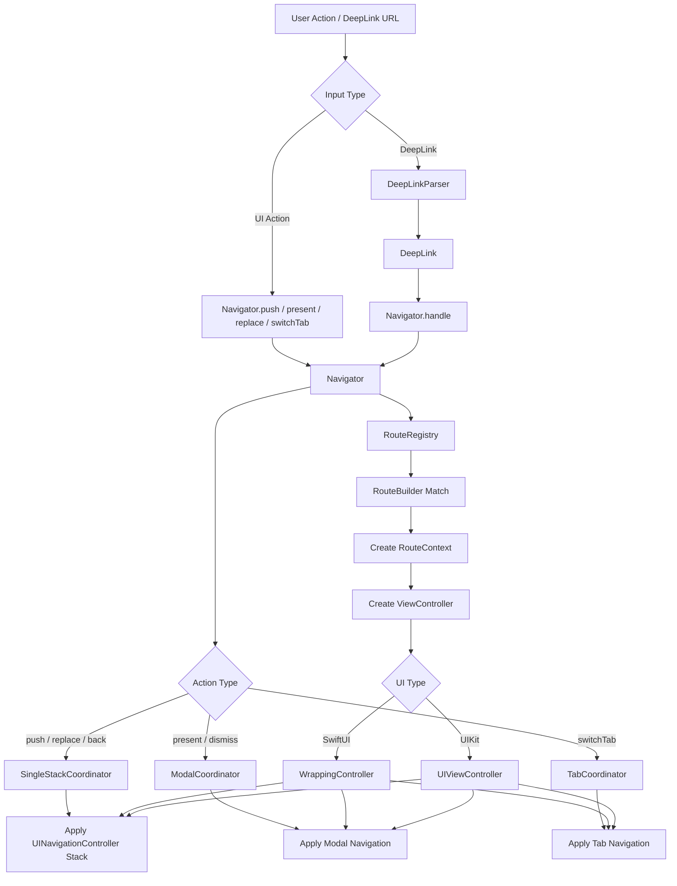

<!--  -->
[한국어](./README.md) | [English](./README.en.md)

# TurboNavigator

`TurboNavigator` is a typed route-based navigation library that runs SwiftUI screens on top of UIKit's `UINavigationController` and `UITabBarController`.

You build screens with SwiftUI and drive transitions through `enum` routes and `Navigator` commands. This keeps the declarative UI layer intact while bringing stack, tab, modal, and deep link flows under one explicit API.

| Category | Support |
| --- | --- |
| Minimum deployment target | `iOS 13` |
| UI layer | `SwiftUI` |
| Navigation engine | `UIKit` |

## Examples

|  |  |  |  |  |
|:---:|:---:|:---:|:---:|:---:|
| push(A) | push([A, B]) | present | presentFullScreen | DeepLink |

## Contents

- [What problem does it solve?](#what-problem-does-it-solve)
- [Core components](#core-components)
- [Key features](#key-features)
- [Demo projects](#demo-projects)
- [Installation](#installation)
- [Quick Start](#quick-start)
- [Usage notes](#usage-notes)
- [API and time complexity](#api-and-time-complexity)
- [Architecture](#architecture)

## What problem does it solve?

As an app grows, push, modal, tab, and deep link flows tend to spread across different state models and calling conventions. `TurboNavigator` brings those transitions under one `Navigator` interface and one typed route flow.

- Bring `NavigationStack`, `TabView`, `sheet`, and `fullScreenCover` transitions under one policy.
- Run SwiftUI screens and existing UIKit `UIViewController` screens in one navigation flow.
- Use the same calling style for push, sheet, full-screen modal, tab switching, and stack replacement.
- Resolve in-app actions, WebView links, push notifications, universal links, and custom schemes into typed routes.
- Keep the rule for “which link or event opens which screen” outside individual screens.
- Make transitions type-safe and traceable with `enum` routes and explicit dependency injection.

### Why use a UIKit engine?

`NavigationStack` works well when a single stack can be expressed as a declarative path. Once navigation also needs transition policies, however, path mutations and screen-level control code can spread quickly. `TurboNavigator` keeps SwiftUI focused on screen composition while UIKit handles complex transitions.

- Handle `stack`, `tab`, `modal`, and `deep link` transitions through one `Navigator` API.
- `Navigator` decides whether push, back, or replace should target the root, selected tab, or modal stack.
- Imperative actions such as `backTo`, `backOrPush`, `replace`, and `switchTab` use one calling style.
- Replace the root flow after login, or rebuild it as `[.home, .detail(id: ...)]` when handling a deep link.
- Build `[.home, .promotion, .detail(id: ...)]` after onboarding, or present a modal with multiple routes already in place.
- Treat route arrays, rather than raw `UIViewController` references, as the source of truth for inspecting, comparing, and restoring navigation state.
- Control navigation-bar and tab-bar visibility, tab animations, interactive-dismiss cleanup, and existing `UIViewController` reuse at the controller layer.
- Keep the same API when some screens use SwiftUI and others use `UIViewController`.
- Keep rules such as “push onto the modal if one is active, otherwise push onto the currently selected tab stack” outside screen code.
- Configure `UITabBarController` and `UINavigationController` behavior, including opting out of the iOS 18 system tab transition animation.
- Support `iOS 13` without depending exclusively on newer APIs such as `NavigationStack`.

### When is `NavigationStack` a better fit?

For a small SwiftUI app whose single stack is already well modeled by `NavigationStack(path:)`, adding `TurboNavigator` may create more structure than you need.

## Core components

| Component | Role |
| --- | --- |
| `Navigator` | Main entry point for push, replace, back, modal, tab, and deep link actions |
| `RouteRegistry` | Registry that maps each route to a screen builder |
| `RouteContext` | Execution context passed to builders, containing `route`, `navigator`, and `dependencies` |
| `NavigationContainer` / `TabNavigationContainer` | SwiftUI bridges that host the UIKit navigation engine |
| `DeepLinkParser` | Protocol that converts a URL into a typed route-based deep link |

## Key features

| Feature | Description |
| --- | --- |
| Multi-route push/present | Build flows such as `push([.home, .detail(id: "42")])` or `present([.login, .terms])` in one call. |
| Route-aware stack control | Use `backTo`, `backOrPush`, and `currentRoutes` to reason about the stack in route terms. |
| Modal control | Call `present`, `presentFullScreen`, and `dismissModal`, with an optional modal presentation style. |
| Per-tab configuration | Set `prefersLargeTitles` and `hapticStyle` independently on each `TabNavigationItem`. |
| Tab UX controls | Pop to root when reselecting a tab, use `isTabBarHidden`, or opt out of the iOS 18 system tab transition animation. |
| `WrappingController` controls | Tune navigation-bar and tab-bar visibility per screen with `title`, `isNavigationBarHidden`, and `isTabBarHiddenWhenPushed`. |
| Modal state cleanup | Clear internal modal state after an interactive sheet dismissal so stale references do not linger. |
| Debug stack dump | Inspect root, tab, and modal stacks with `debugSnapshot`, `debugStackDescription`, and `printStacks`. |
| Preview helpers | Create a mock navigator for SwiftUI previews with `Navigator.preview` and `PreviewDependencies`. |

## Current status

- Implemented: typed route-based `Navigator`, `RouteRegistry`, explicit DI, stack/modal/tab operations, deep link entry point, SwiftUI bridge, tab haptics, iOS 18 system tab transition animation opt-out, demo app
- Lower priority: generalized nested modal handling, `remove`-style operations, default deep link parser implementation, state restoration, expanded UIKit-only examples

## Demo projects

| Demo | What it covers |
| --- | --- |
| [TCA + TurboNavigator modular demo](./Demo/SwiftUITCATurboModularDemo) | TCA feature modules, a navigation dependency, `RouteRegistry` composition, `TestStore` tests, and UI navigation tests |
| [SwiftUI modular demo](./Demo/SwiftUIModularDemo) | Feature-level modules composed with `TurboNavigator` |
| [Interface/Implementation modular demo](./Demo/SwiftUIInterfaceModularDemo) | Dependency boundaries split into interface and implementation targets |

If you are integrating TCA for the first time, start with the [TCA modular demo guide](./Demo/SwiftUITCATurboModularDemo/README.md).

## Installation

### Swift Package Manager

Xcode:

1. `File > Add Package Dependencies...`
2. Enter the repository URL
3. Choose the version / branch / commit you want
4. Link `TurboNavigator` to your app target

Local package:

1. `File > Add Package Dependencies...`
2. Select `Add Local...`
3. Choose the folder that contains `TurboNavigator/Package.swift`

Add it directly from `Package.swift`:

```swift
dependencies: [
  .package(url: "https://github.com/indextrown/TurboNavigator.git", from: "1.1.1")
]
```

```swift
targets: [
  .target(
    name: "YourApp",
    dependencies: [
      .product(name: "TurboNavigator", package: "TurboNavigator")
    ])
]
```

For the public repository, use `https://github.com/indextrown/TurboNavigator.git` with `from: "1.1.1"`.
If you are developing the app and package together locally, the local package option is the fastest.

## Quick Start

Follow these steps for a first integration.

### 1. Define routes

```swift
enum AppRoute: Hashable {
  case home
  case detail(id: String)
  case settings
}
```

### 2. Define dependencies

```swift
struct AppDependencies {
  let userRepository: UserRepository
  let analytics: AnalyticsClient
}
```

### 3. Build the `RouteRegistry`

```swift
let registry = RouteRegistry<AppDependencies, AppRoute>()
  .registering(.home) { context in
    // In a UIKit-only project, you can return a UIViewController directly
    // instead of using WrappingController.
    WrappingController(route: context.route, title: "Home") {
      HomeView(navigator: context.navigator)
    }
  }
  .registering(
    extracting: { (route: AppRoute) -> String? in
      guard case let .detail(id) = route else { return nil }
      return id
    },
    build: { context, id in
      WrappingController(route: context.route, title: "Detail") {
        DetailView(
          userID: id,
          repository: context.dependencies.userRepository,
          navigator: context.navigator)
      }
    })
  .registering(.settings) { context in
    WrappingController(route: context.route, title: "Settings") {
      SettingsView(navigator: context.navigator)
    }
  }
```

### 4. Create a `Navigator`

```swift
let navigator = Navigator(
  dependencies: AppDependencies(
    userRepository: DefaultUserRepository(),
    analytics: DefaultAnalyticsClient()),
  registry: registry
)
```

### 5. Connect it to SwiftUI

Single stack app:

```swift
NavigationContainer(
  navigator: navigator,
  initialRoutes: [.home],
  prefersLargeTitles: true
)
```

Tab-based app:

```swift
TabNavigationContainer(
  navigator: navigator,
  items: [
    .init(
      tag: 0,
      route: .home,
      tabBarItem: UITabBarItem(title: "Home", image: nil, tag: 0),
      prefersLargeTitles: true,
      hapticStyle: .selection),
    .init(
      tag: 1,
      route: .settings,
      tabBarItem: UITabBarItem(title: "Settings", image: nil, tag: 1),
      prefersLargeTitles: false)
  ],
  disablesSystemTabTransitionAnimation: true
)
```

### 6. Call it from screens

```swift
navigator.push(.detail(id: "42"))
navigator.present(.settings)
navigator.presentFullScreen(.settings)
navigator.present(.settings, style: .pageSheet)
navigator.back()
navigator.backTo(.home)
navigator.backOrPush(.settings)
navigator.switchTab(tag: 1)
navigator.currentRoutes()
```

Use `backTo` to return to a route already in the stack, or `backOrPush` to push it when it is absent. Call `currentRoutes()` first when the action depends on the current stack.

Both `backTo` and `backOrPush` require screens whose routes can be tracked.

### 7. Hook up deep links

```swift
struct AppDeepLinkParser: DeepLinkParser {
  func parse(url: URL) -> DeepLink<AppRoute>? {
    guard let components = URLComponents(url: url, resolvingAgainstBaseURL: false) else {
      return nil
    }

    switch components.host {
    case "home":
      return DeepLink(route: .home, action: .replace)
    case "settings":
      return DeepLink(route: .settings, action: .present(style: .fullScreen))
    case "detail":
      let id = components.queryItems?.first(where: { $0.name == "id" })?.value ?? ""
      guard !id.isEmpty else { return nil }
      return DeepLink(route: .detail(id: id), action: .push)
    default:
      return nil
    }
  }
}
```

```swift
.onOpenURL { url in
  navigator.handle(url: url, parser: AppDeepLinkParser())
}
```

Example URLs:

- `turbonavigator://home`
- `turbonavigator://detail?id=42`
- `turbonavigator://settings`

## Usage notes

### Routes and screen registration

- Routes can mix fixed cases like `.home` with associated-value cases like `.detail(id:)`.
- Gather external dependencies in `Dependencies`, then access them inside builders through `context.dependencies`.
- Register fixed routes with `registering(_:)`, associated-value routes with `registering(extracting:)`, and conditional routes with `registering(matching:)`.
- A builder can wrap a SwiftUI screen in `WrappingController` or return a `UIViewController` directly in a UIKit project.
- `backTo` and `backOrPush` work with screens whose routes can be tracked. A UIKit screen that does not use `WrappingController` must adopt `AnyRouteIdentifiable` directly.

### Screen presentation settings

- `WrappingController` hides the navigation bar by default when `title == nil`. To keep the bar without a title, set `title: ""` or `isNavigationBarHidden: false`.
- Set `disablesSystemTabTransitionAnimation` on `TabNavigationContainer` to `true` if you want to opt out of the iOS 18 system tab transition animation. The same setting applies to both tab-bar taps and `navigator.switchTab(tag:)`.
- Screens do not need to manipulate `UIViewController` directly; they can call `navigator`, use `push` or `back` for ordinary movement, and use `replace` to rebuild the stack.
- A parsed deep link can also choose `replace` when it needs to reset the current flow.

### Runtime policies

- For deep links, the app receives the URL, the parser converts it into `DeepLink<Route>`, and `navigator.handle(url:parser:)` executes it.
- Screens only issue `navigator` commands; transition rules stay outside screen code.
- Create and call `Navigator`, coordinators, route builders, and SwiftUI/UIKit adapters on the `MainActor` because they manage UIKit state.
- While a modal transition is in progress, another `present` is ignored and `dismissModal` is deferred until presentation completes. Stack commands target the selected tab or root instead of a stale modal, and a failed modal build keeps the existing modal state.

## Adoption checklist

1. Did you define `AppRoute`?
2. Did you define `AppDependencies`?
3. Did you register screens in `RouteRegistry`?
4. Did you create a `Navigator`?
5. Did you connect `NavigationContainer` or `TabNavigationContainer`?
6. Are your screens calling `navigator.push/present/back`?

## API and time complexity

The time complexity below is an approximate cost based on the current implementation.

| Symbol | Meaning |
| --- | --- |
| `B` | Number of registered `RouteBuilder`s |
| `S` | Length of the currently active `UINavigationController` stack |
| `R` | Number of routes passed at once |
| `T` | Number of tabs |
| `P` | Cost of the parser implemented by the app |
| `A` | Cost of executing the parsed action |

| Category | API |
| --- | --- |
| Stack | `push`, `replace`, `back`, `backTo`, `backOrPush`, `currentRoutes` |
| Modal | `present`, `presentFullScreen`, `dismissModal` |
| Tab | `switchTab` |
| State | `isModalActive` |
| Deep link | `handle(_:)`, `handle(url:parser:)` |
| Debug | `debugSnapshot`, `debugStackDescription`, `printStacks` |

### Stack

- `push(_ route:)`: `O(B + S)`
- `push(_ routes:)`: `O(R * B + (S + R))`
- `replace(with:)`: `O(R * B + R)`
- `back()`: `O(1)`
- `backTo(_ route:)`: `O(S)`
- `backOrPush(_ route:)`: `O(S)` if the route exists, otherwise `O(S + B)`
- `currentRoutes()`: `O(S)`

### Modal

- `present(_ route:)`: `O(B)`
- `present(_ routes:)`: `O(R * B + R)`
- `presentFullScreen(_ route:)`: `O(B)`
- `presentFullScreen(_ routes:)`: `O(R * B + R)`
- `dismissModal()`: `O(1)`
- `isModalActive`: `O(1)`

### Tab

- `switchTab(tag:)`: `O(1)`
- `switchTab(tag:popToRootIfSelected:)`: `O(1)` for a normal tab switch, `O(S)` when reselecting the same tab and popping to root

### Deep link

- `handle(_ deepLink:)`: follows the same cost as `push`, `replace`, or `present`, depending on the deep link action
- `handle(url:parser:)`: `O(P + A)`

### Debugging

- `debugSnapshot()`: `O(S + T * S)`
- `debugStackDescription()`: `O(S + T * S)`
- `printStacks()`: `O(S + T * S)`

### Navigation policies

- Each tab owns its own `UINavigationController`.
- Only one modal layer is kept at a time, and presenting a new modal replaces the existing modal.
- If a modal is active, its modal stack becomes the current active stack.
- Deep link parsing is handled by the app, while the navigator executes the parsed action.

## Architecture


```mermaid
flowchart TD
    A[User Action / DeepLink URL] --> B{Input Type}

    B -->|UI Action| C[Navigator.push / present / replace / switchTab]
    B -->|DeepLink| D[DeepLinkParser]
    D --> E[DeepLink]
    E --> F[Navigator.handle]

    C --> G[Navigator]
    F --> G

    G --> H{Action Type}

    H -->|push / replace / back| I[SingleStackCoordinator]
    H -->|present / dismiss| J[ModalCoordinator]
    H -->|switchTab| K[TabCoordinator]

    G --> L[RouteRegistry]
    L --> M[RouteBuilder Match]
    M --> N[Create RouteContext]
    N --> O[Create ViewController]

    O --> P{UI Type}
    P -->|SwiftUI| Q[WrappingController]
    P -->|UIKit| R[UIViewController]

    I --> S[Apply UINavigationController Stack]
    J --> T[Apply Modal Navigation]
    K --> U[Apply Tab Navigation]

    Q --> S
    R --> S
    Q --> T
    R --> T
    Q --> U
    R --> U
```

<!-- ## Sample app

Recommended files to inspect first:

- Entry point: [TurboNavigatorDemoApp.swift](/Users/kimdonghyeon/2025/개발/라이브러리/TurboNavigator/Demo/TurboNavigatorDemo/TurboNavigatorDemo/TurboNavigatorDemoApp.swift)
- Routing composition: [AppDelegate.swift](/Users/kimdonghyeon/2025/개발/라이브러리/TurboNavigator/Demo/TurboNavigatorDemo/TurboNavigatorDemo/AppDelegate.swift)
- Home test screen: [HomeView.swift](/Users/kimdonghyeon/2025/개발/라이브러리/TurboNavigator/Demo/TurboNavigatorDemo/TurboNavigatorDemo/View/HomeView.swift)
- Detail test screen: [DetailView.swift](/Users/kimdonghyeon/2025/개발/라이브러리/TurboNavigator/Demo/TurboNavigatorDemo/TurboNavigatorDemo/View/DetailView.swift)
- MVVM sample screen: [MVVMSampleView.swift](/Users/kimdonghyeon/2025/개발/라이브러리/TurboNavigator/Demo/TurboNavigatorDemo/TurboNavigatorDemo/View/MVVMSampleView.swift)
- Settings test screen: [SettingView.swift](/Users/kimdonghyeon/2025/개발/라이브러리/TurboNavigator/Demo/TurboNavigatorDemo/TurboNavigatorDemo/View/SettingView.swift)
- Xcode project: [TurboNavigatorDemo.xcodeproj](/Users/kimdonghyeon/2025/개발/라이브러리/TurboNavigator/Demo/TurboNavigatorDemo/TurboNavigatorDemo.xcodeproj)

`TurboNavigatorDemo` is not just a showcase app, but an operation-testing sample.

`MVVMSampleView` also demonstrates a setup where the view does not own its state directly, and `MVVMSampleViewModel` manages state and navigation actions as an `ObservableObject`. You can try it from the `Push MVVM Sample` and `Present MVVM Sample` buttons on the home screen.
You can directly test stack, modal, and tab operations from the home, detail, and settings screens.

## Reference

- Package definition: [Package.swift](/Users/kimdonghyeon/2025/개발/라이브러리/TurboNavigator/Package.swift)
- Demo app entry point: [TurboNavigatorDemoApp.swift](/Users/kimdonghyeon/2025/개발/라이브러리/TurboNavigator/Demo/TurboNavigatorDemo/TurboNavigatorDemo/TurboNavigatorDemoApp.swift) -->
