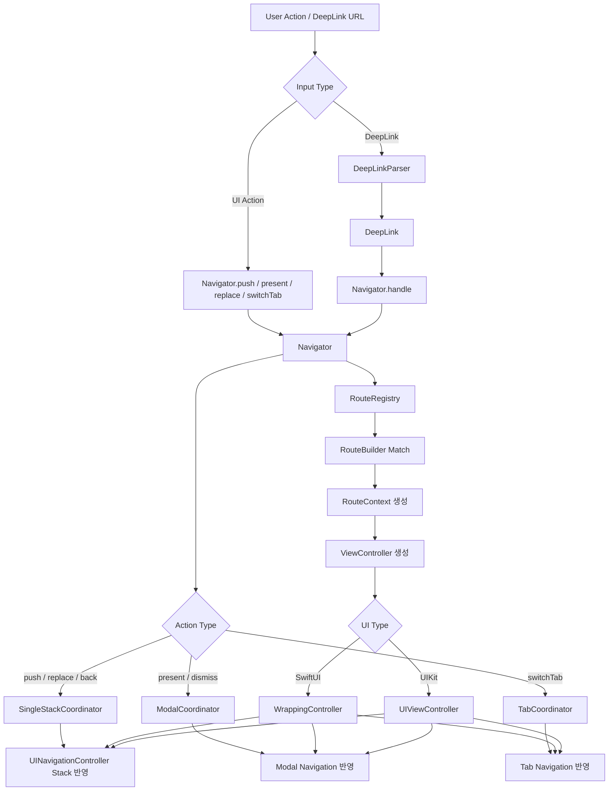

<!--  -->
[한국어](./README.md) | [English](./README.en.md)

# Example
|  |  |  |  |  |
|:---:|:---:|:---:|:---:|:---:|
| push(A) | push([A, B]) | present | presentFullScreen | DeepLink |

# TurboNavigator

`TurboNavigator`는 UIKit navigation controller를 엔진으로 사용하는 typed route 기반 navigation 라이브러리다.    
SwiftUI로 화면을 만들면서도, 실제 이동 제어는 UIKit stack, tab, modal 위에서 명시적으로 다룰 수 있게 설계했다.

## 지원 환경

- 최소 지원 버전: `iOS 13`
- UI 작성: `SwiftUI`
- navigation 엔진: `UIKit`

## 왜 UIKit 엔진 기반인가

`NavigationStack`은 선언형 화면 경로 표현에는 좋지만, 실제 앱에서 자주 필요한 아래 흐름을 한 곳에서 운영하기에는 불편한 지점이 있다.

- 현재 push 대상이 root stack인지, tab stack인지, modal 위인지 매번 의식해야 한다.
- `backTo`, `backOrPush`, `replace`, 동일 탭 재선택 시 root 복귀 같은 imperative 제어가 앱 구조 곳곳에 흩어지기 쉽다.
- `stack`, `tab`, `modal`, `deep link`마다 호출 방식이 달라 한 흐름으로 묶어 다루기 어렵다.
- SwiftUI 화면은 잘 작성되더라도, 복잡한 화면 전환은 결국 별도로 정리된 제어 계층이 필요해진다.

`TurboNavigator`는 이 지점을 해결하기 위해 화면은 SwiftUI로 만들고, 실제 navigation 엔진은 UIKit으로 두었다.

### 강점

- `stack`, `tab`, `modal`, `deep link`를 하나의 `Navigator` API로 통합한다.
- 현재 활성 대상이 root stack인지, tab stack인지, modal stack인지 `Navigator`가 판단하므로 호출부가 단순해진다.
- `backTo`, `backOrPush`, `replace`, `switchTab` 같은 imperative 동작을 같은 호출 방식으로 다룰 수 있다.
- `enum` 기반 route와 명시적 dependency injection으로 타입 안전하고 추적 가능한 navigation 구성을 만든다.
- SwiftUI는 화면 작성에 집중하고, 복잡한 전환 제어는 UIKit 엔진에 맡기는 역할 분리가 가능하다.
- `NavigationStack` 같은 최신 navigation API에만 묶이지 않아 `iOS 13`까지 대응 가능한 구조를 가진다.

### 핵심 구성

- `Navigator`
  - push, replace, back, modal, tab 전환을 실행하는 메인 진입점
- `RouteRegistry`
  - route마다 어떤 화면을 만들지 등록하는 장소
- `RouteContext`
  - builder에 전달되는 실행 컨텍스트. `route`, `navigator`, `dependencies`를 포함
- `NavigationContainer` / `TabNavigationContainer`
  - SwiftUI에서 UIKit navigation 엔진을 올리는 bridge
- `DeepLinkParser`
  - URL을 typed route 기반 deep link로 바꾸는 parser 프로토콜

### 놓치기 쉬운 기능

- 다중 route push/present
  - `push([.home, .detail(id: "42")])`, `present([.login, .terms])`처럼 한 번에 여러 화면을 구성할 수 있다.
- route 기반 되돌아가기
  - `backTo`, `backOrPush`, `currentRoutes`로 현재 스택을 route 단위로 다룰 수 있다.
- 탭별 설정
  - `TabNavigationItem`마다 `prefersLargeTitles`, `hapticStyle`을 다르게 줄 수 있다.
- 탭 UX 제어
  - 같은 탭 재선택 시 root 복귀, `isTabBarHidden`, iOS 18 기본 탭 전환 애니메이션 비활성화를 지원한다.
- WrappingController 세부 제어
  - `title`, `isNavigationBarHidden`, `isTabBarHiddenWhenPushed`로 네비게이션 바와 탭 바 표시를 화면 단위로 조절할 수 있다.
- modal 안정성
  - sheet를 스와이프로 닫은 경우도 내부 modal 상태를 정리해 stale 참조가 남지 않도록 처리한다.
- preview helper
  - `Navigator.preview`와 `PreviewDependencies`로 SwiftUI Preview에서 mock navigator를 빠르게 만들 수 있다.

<br/><br/>


## 현재 상태

- 구현됨: typed route 기반 `Navigator`, `RouteRegistry`, explicit DI, stack/modal/tab 연산, deep link entry point, SwiftUI bridge, preview helper, tab haptic, iOS 18 탭 전환 애니메이션 비활성화 옵션, demo app
- 후순위: nested modal 일반화, `remove` 계열 연산, deep link parser 기본 구현, state restoration, UIKit-only 예제 확장

## 설치

### Swift Package Manager

Xcode:

1. `File > Add Package Dependencies...`
2. 저장소 URL 입력
3. 원하는 version / branch / commit 선택
4. 앱 타깃에 `TurboNavigator` 연결

로컬 패키지:

1. `File > Add Package Dependencies...`
2. `Add Local...` 선택
3. `TurboNavigator/Package.swift` 폴더 선택

`Package.swift`로 직접 추가하는 방법:

```swift
dependencies: [
  .package(url: "https://github.com/indextrown/TurboNavigator.git", from: "1.1.1")
]
```

```swift
targets: [
  .target(
    name: "YourApp",
    dependencies: [
      .product(name: "TurboNavigator", package: "TurboNavigator")
    ])
]
```

공개 저장소를 기준으로 붙일 때는 `https://github.com/indextrown/TurboNavigator.git`와 `from: "1.1.1"` 조합을 사용하면 된다.
로컬에서 같이 개발 중이면 로컬 패키지 방식이 가장 빠르다.

## 빠른 시작

처음 붙일 때는 아래 순서대로 하면 된다.

### 1. Route 정의

```swift
enum AppRoute: Hashable {
  case home
  case detail(id: String)
  case settings
}
```

### 2. Dependencies 정의

```swift
struct AppDependencies {
  let userRepository: UserRepository
  let analytics: AnalyticsClient
}
```

### 3. RouteRegistry 구성

```swift
let registry = RouteRegistry<AppDependencies, AppRoute>()
  .registering(.home) { context in
    // UIKit 프로젝트에서는 WrappingController 대신 UIViewController를 직접 반환하면 된다.
    WrappingController(route: context.route, title: "Home") {
      HomeView(navigator: context.navigator)
    }
  }
  .registering(
    extracting: { (route: AppRoute) -> String? in
      guard case let .detail(id) = route else { return nil }
      return id
    },
    build: { context, id in
      WrappingController(route: context.route, title: "Detail") {
        DetailView(
          userID: id,
          repository: context.dependencies.userRepository,
          navigator: context.navigator)
      }
    })
  .registering(.settings) { context in
    WrappingController(route: context.route, title: "Settings") {
      SettingsView(navigator: context.navigator)
    }
  }
```

### 4. Navigator 생성

```swift
let navigator = Navigator(
  dependencies: AppDependencies(
    userRepository: DefaultUserRepository(),
    analytics: DefaultAnalyticsClient()),
  registry: registry
)
```

### 5. SwiftUI에 연결

단일 스택 앱:

```swift
NavigationContainer(
  navigator: navigator,
  initialRoutes: [.home],
  prefersLargeTitles: true
)
```

탭 앱:

```swift
TabNavigationContainer(
  navigator: navigator,
  items: [
    .init(
      tag: 0,
      route: .home,
      tabBarItem: UITabBarItem(title: "Home", image: nil, tag: 0),
      prefersLargeTitles: true,
      hapticStyle: .selection),
    .init(
      tag: 1,
      route: .settings,
      tabBarItem: UITabBarItem(title: "Settings", image: nil, tag: 1),
      prefersLargeTitles: false)
  ],
  isTabBarHidden: false,
  disablesSystemTabTransitionAnimation: true
)
```

### 6. 화면에서 호출

```swift
navigator.push(.detail(id: "42"))
navigator.present(.settings)
navigator.presentFullScreen(.settings)
navigator.present(.settings, style: .pageSheet)
navigator.back()
navigator.backTo(.home)
navigator.backOrPush(.settings)
navigator.switchTab(tag: 1)
navigator.currentRoutes()
```

필요하면 modal 스타일도 직접 지정할 수 있다.

```swift
navigator.present(.settings, style: .pageSheet)
navigator.present(.settings, style: .overFullScreen)
```

### 7. Deep Link 연결

```swift
struct AppDeepLinkParser: DeepLinkParser {
  func parse(url: URL) -> DeepLink<AppRoute>? {
    guard let components = URLComponents(url: url, resolvingAgainstBaseURL: false) else {
      return nil
    }

    switch components.host {
    case "home":
      return DeepLink(route: .home, action: .replace)
    case "settings":
      return DeepLink(route: .settings, action: .present(style: .fullScreen))
    case "detail":
      let id = components.queryItems?.first(where: { $0.name == "id" })?.value ?? ""
      guard !id.isEmpty else { return nil }
      return DeepLink(route: .detail(id: id), action: .push)
    default:
      return nil
    }
  }
}
```

```swift
.onOpenURL { url in
  navigator.handle(url: url, parser: AppDeepLinkParser())
}
```

예시 URL:

- `turbonavigator://home`
- `turbonavigator://detail?id=42`
- `turbonavigator://settings`

## 사용 포인트

- route는 `.home` 같은 고정 case와 `.detail(id:)` 같은 연관값 case를 함께 사용할 수 있다.
- 외부 의존성은 `Dependencies`로 모으고 builder 안에서는 `context.dependencies`로 접근한다.
- 고정 route는 `registering(_:)`, 연관값 route는 `registering(extracting:)`, 조건 기반 route는 `registering(matching:)`로 등록한다.
- builder는 `WrappingController`로 SwiftUI 화면을 감쌀 수도 있고, UIKit 프로젝트에서는 `UIViewController`를 직접 반환해도 된다.
- `WrappingController`는 `title == nil`이면 기본적으로 navigation bar를 숨긴다. 제목 없이 bar를 유지하고 싶으면 `title: ""` 또는 `isNavigationBarHidden: false`를 명시해야 한다.
- `TabNavigationContainer`의 `disablesSystemTabTransitionAnimation`을 `true`로 주면 iOS 18 이상에서 기본 탭 전환 애니메이션을 끌 수 있다. 탭바 직접 탭 전환과 `navigator.switchTab(tag:)` 둘 다 같은 설정을 따른다.
- 화면에서는 `UIViewController`를 직접 다루지 않고 `navigator`만 호출하면 된다.
- `backTo`와 `backOrPush`는 route를 추적할 수 있는 화면에서 동작한다. `WrappingController`를 쓰지 않는 UIKit 화면이라면 `AnyRouteIdentifiable`를 직접 채택해야 한다.
- deep link는 앱이 URL을 받고 parser가 `DeepLink<Route>`로 바꾼 뒤 `navigator.handle(url:parser:)`로 연결한다.

## Preview 지원

SwiftUI Preview에서 mock navigator를 빠르게 만들 수 있다.

```swift
#Preview {
  SampleView(navigator: .preview)
}
```

`Dependencies`가 있으면 `PreviewDependencies`를 채택해 기본 preview 값을 줄 수 있다.

```swift
extension AppDependencies: PreviewDependencies {
  static var preview: Self {
    .init(
      userRepository: MockUserRepository(),
      analytics: PreviewAnalyticsClient()
    )
  }
}

#Preview {
  HomeView(navigator: .preview)
}
```

## 도입 체크리스트

1. `AppRoute`를 만들었는가
2. `AppDependencies`를 만들었는가
3. `RouteRegistry`에 화면을 등록했는가
4. `Navigator`를 생성했는가
5. `NavigationContainer` 또는 `TabNavigationContainer`에 연결했는가
6. 화면에서 `navigator.push/present/back`를 호출하고 있는가

## 지원 연산

아래 시간복잡도는 현재 구현 기준의 대략적인 비용이다.

- `B`: 등록된 `RouteBuilder` 개수
- `S`: 현재 활성 `UINavigationController` stack 길이
- `R`: 한 번에 전달한 route 개수
- `P`: 앱이 구현한 parser 비용
- `A`: 파싱된 action 실행 비용

- Stack: `push`, `replace`, `back`, `backTo`, `backOrPush`, `currentRoutes`
- Modal: `present`, `presentFullScreen`, `dismissModal`
- Tab: `switchTab`
- State: `isModalActive`
- Deep Link: `handle(_:)`, `handle(url:parser:)`

### Stack

- `push(_ route:)`: `O(B + S)`
- `push(_ routes:)`: `O(R * B + (S + R))`
- `replace(with:)`: `O(R * B + R)`
- `back()`: `O(1)`
- `backTo(_ route:)`: `O(S)`
- `backOrPush(_ route:)`: route가 있으면 `O(S)`, 없으면 `O(S + B)`
- `currentRoutes()`: `O(S)`

### Modal

- `present(_ route:)`: `O(B)`
- `present(_ routes:)`: `O(R * B + R)`
- `presentFullScreen(_ route:)`: `O(B)`
- `presentFullScreen(_ routes:)`: `O(R * B + R)`
- `dismissModal()`: `O(1)`
- `isModalActive`: `O(1)`

### Tab

- `switchTab(tag:)`: `O(1)`
- `switchTab(tag:popToRootIfSelected:)`: 탭 전환만 하면 `O(1)`, 같은 탭 재선택 후 root 복귀는 `O(S)`

### Deep Link

- `handle(_ deepLink:)`: deep link action에 따라 `push`, `replace`, `present` 비용을 그대로 따른다.
- `handle(url:parser:)`: `O(P + A)`

정책:

- 각 탭은 독립 `UINavigationController`를 가진다.
- modal은 한 번에 한 계층만 유지하고, 새 modal은 기존 modal을 교체한다.
- modal이 떠 있으면 modal 스택이 현재 활성 스택이 된다.
- deep link parsing은 앱이 담당하고, navigator는 파싱된 action을 실행한다.

## DeepLink 직접 실행

URL parser 없이 `DeepLink<Route>`를 직접 만들어 실행할 수도 있다.

```swift
let deepLink = DeepLink(
  routes: [.home, .detail(id: "42")],
  action: .push
)

navigator.handle(deepLink)
```

## Architecture


<!-- ## 샘플 앱

가장 먼저 보는 걸 추천하는 파일은 아래다.

- 진입점: [TurboNavigatorDemoApp.swift](/Users/kimdonghyeon/2025/개발/라이브러리/TurboNavigator/Demo/TurboNavigatorDemo/TurboNavigatorDemo/TurboNavigatorDemoApp.swift)
- 라우팅 조립: [AppDelegate.swift](/Users/kimdonghyeon/2025/개발/라이브러리/TurboNavigator/Demo/TurboNavigatorDemo/TurboNavigatorDemo/AppDelegate.swift)
- 홈 테스트 화면: [HomeView.swift](/Users/kimdonghyeon/2025/개발/라이브러리/TurboNavigator/Demo/TurboNavigatorDemo/TurboNavigatorDemo/View/HomeView.swift)
- 디테일 테스트 화면: [DetailView.swift](/Users/kimdonghyeon/2025/개발/라이브러리/TurboNavigator/Demo/TurboNavigatorDemo/TurboNavigatorDemo/View/DetailView.swift)
- MVVM 샘플 화면: [MVVMSampleView.swift](/Users/kimdonghyeon/2025/개발/라이브러리/TurboNavigator/Demo/TurboNavigatorDemo/TurboNavigatorDemo/View/MVVMSampleView.swift)
- 설정 테스트 화면: [SettingView.swift](/Users/kimdonghyeon/2025/개발/라이브러리/TurboNavigator/Demo/TurboNavigatorDemo/TurboNavigatorDemo/View/SettingView.swift)
- Xcode 프로젝트: [TurboNavigatorDemo.xcodeproj](/Users/kimdonghyeon/2025/개발/라이브러리/TurboNavigator/Demo/TurboNavigatorDemo/TurboNavigatorDemo.xcodeproj)

`TurboNavigatorDemo`는 단순 소개용이 아니라 연산 테스트용 샘플이다.

추가로 `MVVMSampleView`는 View가 상태를 직접 만들지 않고, `MVVMSampleViewModel`이 `ObservableObject`로 상태와 네비게이션 액션을 관리하는 예제다. 홈 화면의 `Push MVVM Sample`, `Present MVVM Sample` 버튼으로 바로 확인할 수 있다.
홈/디테일/설정 화면에서 stack, modal, tab 연산을 직접 눌러볼 수 있다.

## 참고

- 패키지 정의: [Package.swift](/Users/kimdonghyeon/2025/개발/라이브러리/TurboNavigator/Package.swift)
- 데모 앱 진입점: [TurboNavigatorDemoApp.swift](/Users/kimdonghyeon/2025/개발/라이브러리/TurboNavigator/Demo/TurboNavigatorDemo/TurboNavigatorDemo/TurboNavigatorDemoApp.swift) -->
