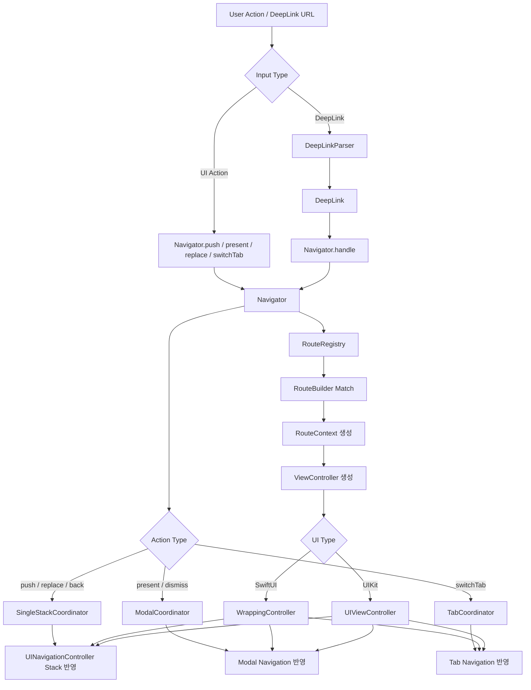

<!--  -->
[한국어](./README.md) | [English](./README.en.md)

# TurboNavigator

`TurboNavigator`는 SwiftUI 화면을 UIKit `UINavigationController`와 `UITabBarController` 위에서 운용하는 typed route 기반 내비게이션 라이브러리입니다.

화면은 SwiftUI로 만들고, 화면 전환은 `enum` route와 `Navigator` 명령으로 제어합니다. SwiftUI의 선언형 화면 작성 방식은 유지하면서 stack, tab, modal, deep link 흐름을 한 곳에서 명시적으로 관리할 수 있습니다.

| 항목 | 지원 범위 |
| --- | --- |
| 최소 지원 버전 | `iOS 13` |
| UI 작성 | `SwiftUI` |
| 내비게이션 엔진 | `UIKit` |

## 동작 예시

|  |  |  |  |  |
|:---:|:---:|:---:|:---:|:---:|
| push(A) | push([A, B]) | present | presentFullScreen | DeepLink |

## 목차

- [해결하는 문제](#해결하는-문제)
- [핵심 구성](#핵심-구성)
- [주요 기능](#주요-기능)
- [예제 프로젝트](#예제-프로젝트)
- [설치](#설치)
- [빠른 시작](#빠른-시작)
- [사용 포인트](#사용-포인트)
- [내비게이션 상태 디버깅](#내비게이션-상태-디버깅)
- [SwiftUI Preview](#swiftui-preview)
- [API와 시간 복잡도](#api와-시간-복잡도)
- [아키텍처](#아키텍처)

## 해결하는 문제

규모가 커진 앱에서는 push, modal, tab, deep link가 서로 다른 상태와 호출 방식으로 흩어지기 쉽습니다. `TurboNavigator`는 이런 전환을 하나의 `Navigator` 인터페이스와 typed route 흐름으로 묶습니다.

- `NavigationStack`, `TabView`, `sheet`, `fullScreenCover`처럼 서로 다른 상태 모델을 쓰는 전환을 하나의 규칙으로 관리합니다.
- SwiftUI 화면과 기존 UIKit `UIViewController` 화면을 한 흐름에서 운영합니다.
- push, sheet, full-screen modal, tab 전환, stack 교체를 같은 방식으로 호출합니다.
- 앱 내부 버튼과 WebView 링크부터 push notification, universal link, custom scheme까지 같은 typed route로 연결합니다.
- 어떤 링크 또는 이벤트가 어떤 화면으로 이어지는지 화면 코드 밖에서 관리합니다.
- `enum` 기반 route와 명시적 dependency injection으로 전환 흐름을 타입 안전하게 추적합니다.

### UIKit 엔진을 사용하는 이유

`NavigationStack`은 단일 stack의 path를 선언적으로 표현할 때 잘 맞습니다. 하지만 화면 상태를 넘어 전환 정책까지 다뤄야 하면 path 배열 조작과 화면별 코드가 늘어나기 쉽습니다. `TurboNavigator`는 SwiftUI가 화면 작성에 집중하도록 두고, 복잡한 전환은 UIKit controller 계층에서 처리합니다.

- `stack`, `tab`, `modal`, `deep link` 전환을 하나의 `Navigator` API로 다룹니다.
- 현재 push 대상이 root stack인지, tab stack인지, modal stack인지 `Navigator`가 판단합니다.
- `backTo`, `backOrPush`, `replace`, `switchTab` 같은 imperative 동작을 같은 호출 방식으로 제공합니다.
- 로그인 후 root stack을 교체하거나 deep link 진입 시 `[.home, .detail(id: ...)]`처럼 stack 전체를 다시 구성할 수 있습니다.
- onboarding 종료 후 `[.home, .promotion, .detail(id: ...)]`를 쌓거나 modal에 여러 route를 미리 구성할 수 있습니다.
- route 배열을 source of truth로 삼아 원시 `UIViewController` 참조 대신 현재 stack을 읽고, 비교하고, 복원할 수 있습니다.
- navigation bar와 tab bar 표시, tab 전환 애니메이션, interactive dismiss 정리, 기존 `UIViewController` 재사용처럼 controller 계층이 필요한 동작을 직접 제어합니다.
- 일부 화면은 SwiftUI, 일부 화면은 `UIViewController`인 앱에서도 같은 API를 유지합니다.
- modal이 떠 있으면 modal에 push하고, 그렇지 않으면 현재 선택된 tab stack에 push하는 규칙을 화면 코드 밖에 둡니다.
- iOS 18의 기본 tab 전환 애니메이션을 끄는 등 `UITabBarController`와 `UINavigationController` 수준의 설정을 지원합니다.
- 최신 `NavigationStack`에만 의존하지 않으므로 `iOS 13`까지 지원합니다.

### `NavigationStack`이 더 잘 맞는 경우

단일 stack을 `NavigationStack(path:)`만으로 충분히 표현할 수 있는 작은 SwiftUI 앱이라면 `TurboNavigator`를 도입하지 않는 편이 더 단순합니다.

## 핵심 구성

| 구성 요소 | 역할 |
| --- | --- |
| `Navigator` | push, replace, back, modal, tab, deep link 실행의 메인 진입점 |
| `RouteRegistry` | route와 화면 builder를 연결하는 registry |
| `RouteContext` | builder에 전달되는 실행 컨텍스트입니다. `route`, `navigator`, `dependencies`를 포함합니다. |
| `NavigationContainer` / `TabNavigationContainer` | UIKit 내비게이션 엔진을 SwiftUI에 연결하는 bridge |
| `DeepLinkParser` | URL을 typed route 기반 deep link로 바꾸는 parser 프로토콜 |

## 주요 기능

| 기능 | 설명 |
| --- | --- |
| 다중 route push/present | `push([.home, .detail(id: "42")])`, `present([.login, .terms])`처럼 여러 화면을 한 번에 구성합니다. |
| route 기반 되돌아가기 | `backTo`, `backOrPush`, `currentRoutes`로 현재 stack을 route 단위로 다룹니다. |
| modal 제어 | `present`, `presentFullScreen`, `dismissModal`을 제공하며 modal presentation style도 지정할 수 있습니다. |
| tab별 설정 | `TabNavigationItem`마다 `prefersLargeTitles`, `hapticStyle`을 다르게 설정합니다. |
| tab UX 제어 | 같은 tab을 다시 선택하면 root로 돌아가며, `isTabBarHidden`과 iOS 18 기본 tab 전환 애니메이션 비활성화를 지원합니다. |
| `WrappingController` 설정 | `title`, `isNavigationBarHidden`, `isTabBarHiddenWhenPushed`로 화면별 navigation bar와 tab bar 표시를 조절합니다. |
| modal 상태 정리 | sheet를 스와이프로 닫아도 내부 modal 상태를 정리해 stale 참조가 남지 않게 합니다. |
| debug stack dump | `debugSnapshot`, `debugStackDescription`, `printStacks`로 root/tab/modal stack 상태를 확인합니다. |
| preview helper | `Navigator.preview`와 `PreviewDependencies`로 SwiftUI Preview용 mock navigator를 만듭니다. |

## 현재 상태

- 구현됨: typed route 기반 `Navigator`, `RouteRegistry`, explicit DI, stack/modal/tab 연산, deep link entry point, SwiftUI bridge, preview helper, tab haptic, iOS 18 탭 전환 애니메이션 비활성화 옵션, demo app
- 후순위: nested modal 일반화, `remove` 계열 연산, deep link parser 기본 구현, state restoration, UIKit-only 예제 확장

## 예제 프로젝트

| 예제 | 확인할 수 있는 내용 |
| --- | --- |
| [TCA + TurboNavigator 모듈러 예제](./Demo/SwiftUITCATurboModularDemo) | TCA Feature 모듈, navigation dependency, `RouteRegistry` 조립, `TestStore`와 화면 전환 UI 테스트 |
| [SwiftUI 모듈러 예제](./Demo/SwiftUIModularDemo) | Feature별 모듈 분리와 `TurboNavigator` 조립 |
| [Interface/Implementation 모듈러 예제](./Demo/SwiftUIInterfaceModularDemo) | 인터페이스와 구현 타깃을 분리한 의존성 구조 |

처음 TCA와 함께 도입하신다면 [TCA 모듈러 예제의 실행 안내](./Demo/SwiftUITCATurboModularDemo/README.md)부터 확인해 주세요.

## 설치

### Swift Package Manager

Xcode:

1. `File > Add Package Dependencies...`
2. 저장소 URL을 입력합니다.
3. 원하는 version / branch / commit을 선택합니다.
4. 앱 타깃에 `TurboNavigator`를 연결합니다.

로컬 패키지:

1. `File > Add Package Dependencies...`
2. `Add Local...`을 선택합니다.
3. `TurboNavigator/Package.swift` 폴더를 선택합니다.

`Package.swift`로 직접 추가하는 방법:

```swift
dependencies: [
  .package(url: "https://github.com/indextrown/TurboNavigator.git", from: "1.1.1")
]
```

```swift
targets: [
  .target(
    name: "YourApp",
    dependencies: [
      .product(name: "TurboNavigator", package: "TurboNavigator")
    ])
]
```

공개 저장소를 기준으로 붙일 때는 `https://github.com/indextrown/TurboNavigator.git`와 `from: "1.1.1"` 조합을 사용하면 됩니다.
로컬에서 함께 개발 중이라면 로컬 패키지 방식이 가장 빠릅니다.

## 빠른 시작

처음 연동할 때는 아래 순서대로 진행하면 됩니다.

### 1. Route를 정의합니다

```swift
enum AppRoute: Hashable {
  case home
  case detail(id: String)
  case settings
}
```

### 2. 의존성을 정의합니다

```swift
struct AppDependencies {
  let userRepository: UserRepository
  let analytics: AnalyticsClient
}
```

### 3. 화면을 `RouteRegistry`에 등록합니다

```swift
let registry = RouteRegistry<AppDependencies, AppRoute>()
  .registering(.home) { context in
    // UIKit 프로젝트에서는 WrappingController 대신 UIViewController를 직접 반환할 수 있습니다.
    WrappingController(route: context.route, title: "Home") {
      HomeView(navigator: context.navigator)
    }
  }
  .registering(
    extracting: { (route: AppRoute) -> String? in
      guard case let .detail(id) = route else { return nil }
      return id
    },
    build: { context, id in
      WrappingController(route: context.route, title: "Detail") {
        DetailView(
          userID: id,
          repository: context.dependencies.userRepository,
          navigator: context.navigator)
      }
    })
  .registering(.settings) { context in
    WrappingController(route: context.route, title: "Settings") {
      SettingsView(navigator: context.navigator)
    }
  }
```

### 4. `Navigator`를 생성합니다

```swift
let navigator = Navigator(
  dependencies: AppDependencies(
    userRepository: DefaultUserRepository(),
    analytics: DefaultAnalyticsClient()),
  registry: registry
)
```

### 5. SwiftUI에 연결합니다

단일 스택 앱:

```swift
NavigationContainer(
  navigator: navigator,
  initialRoutes: [.home],
  prefersLargeTitles: true
)
```

탭 앱:

```swift
TabNavigationContainer(
  navigator: navigator,
  items: [
    .init(
      tag: 0,
      route: .home,
      tabBarItem: UITabBarItem(title: "Home", image: nil, tag: 0),
      prefersLargeTitles: true,
      hapticStyle: .selection),
    .init(
      tag: 1,
      route: .settings,
      tabBarItem: UITabBarItem(title: "Settings", image: nil, tag: 1),
      prefersLargeTitles: false)
  ],
  isTabBarHidden: false,
  disablesSystemTabTransitionAnimation: true
)
```

### 6. 화면에서 호출합니다

```swift
navigator.push(.detail(id: "42"))
navigator.present(.settings)
navigator.presentFullScreen(.settings)
navigator.present(.settings, style: .pageSheet)
navigator.back()
navigator.backTo(.home)
navigator.backOrPush(.settings)
navigator.switchTab(tag: 1)
navigator.currentRoutes()
```

이미 stack에 있는 화면으로 돌아가려면 `backTo`, 화면이 없을 때 push까지 처리하려면 `backOrPush`를 사용합니다. 두 API를 호출하기 전에 `currentRoutes()`로 현재 stack을 확인할 수 있습니다.

`backTo`와 `backOrPush`는 route를 추적할 수 있는 화면에서만 동작합니다.

필요하면 modal 스타일도 직접 지정할 수 있습니다.

```swift
navigator.present(.settings, style: .pageSheet)
navigator.present(.settings, style: .overFullScreen)
```

### 7. Deep link를 연결합니다

```swift
struct AppDeepLinkParser: DeepLinkParser {
  func parse(url: URL) -> DeepLink<AppRoute>? {
    guard let components = URLComponents(url: url, resolvingAgainstBaseURL: false) else {
      return nil
    }

    switch components.host {
    case "home":
      return DeepLink(route: .home, action: .replace)
    case "settings":
      return DeepLink(route: .settings, action: .present(style: .fullScreen))
    case "detail":
      let id = components.queryItems?.first(where: { $0.name == "id" })?.value ?? ""
      guard !id.isEmpty else { return nil }
      return DeepLink(route: .detail(id: id), action: .push)
    default:
      return nil
    }
  }
}
```

```swift
.onOpenURL { url in
  navigator.handle(url: url, parser: AppDeepLinkParser())
}
```

예시 URL:

- `turbonavigator://home`
- `turbonavigator://detail?id=42`
- `turbonavigator://settings`

### URL parser 없이 deep link를 실행합니다

`DeepLink<Route>`를 직접 만들면 URL parser를 거치지 않고도 같은 전환을 실행할 수 있습니다.

```swift
let deepLink = DeepLink(
  routes: [.home, .detail(id: "42")],
  action: .push
)

navigator.handle(deepLink)
```

## 사용 포인트

### Route와 화면 등록

- route는 `.home` 같은 고정 case와 `.detail(id:)` 같은 연관값 case를 함께 사용할 수 있습니다.
- 외부 의존성은 `Dependencies`로 모으고 builder 안에서는 `context.dependencies`로 접근합니다.
- 고정 route는 `registering(_:)`, 연관값 route는 `registering(extracting:)`, 조건 기반 route는 `registering(matching:)`로 등록합니다.
- builder는 `WrappingController`로 SwiftUI 화면을 감쌀 수도 있고, UIKit 프로젝트에서는 `UIViewController`를 직접 반환해도 됩니다.
- `backTo`와 `backOrPush`는 route를 추적할 수 있는 화면에서 동작합니다. `WrappingController`를 쓰지 않는 UIKit 화면이라면 `AnyRouteIdentifiable`을 직접 채택해야 합니다.

### 화면 표시 설정

- `WrappingController`는 `title == nil`이면 기본적으로 navigation bar를 숨깁니다. 제목 없이 bar를 유지하려면 `title: ""` 또는 `isNavigationBarHidden: false`를 지정합니다.
- `TabNavigationContainer`의 `disablesSystemTabTransitionAnimation`을 `true`로 설정하면 iOS 18 이상에서 기본 tab 전환 애니메이션을 끌 수 있습니다. tab bar를 직접 누르거나 `navigator.switchTab(tag:)`을 호출할 때 모두 같은 설정이 적용됩니다.
- 화면에서는 `UIViewController`를 직접 다루지 않고 `navigator`만 호출합니다. stack 전체를 다시 구성할 때도 화면 코드에서 `replace`를 실행하면 됩니다.

### 실행 정책

- deep link는 앱이 URL을 받고 parser가 `DeepLink<Route>`로 바꾼 뒤 `navigator.handle(url:parser:)`로 연결합니다.
- 화면은 `navigator` 명령만 호출하고, 실제 전환 규칙은 화면 코드 밖에서 관리합니다.
- `Navigator`, coordinator, route builder, SwiftUI/UIKit adapter는 UIKit 상태를 다루므로 `MainActor`에서 생성하고 호출합니다.
- modal 전환 중 추가 `present`는 무시하고 `dismissModal`은 present 완료 직후 실행합니다. 이 동안 stack 명령은 stale modal이 아닌 선택된 tab 또는 root를 대상으로 하며, 새 modal build가 실패하면 기존 modal 상태를 유지합니다.

## 내비게이션 상태 디버깅

개발 중에는 현재 내비게이션 상태를 route 기준으로 확인할 수 있습니다.

```swift
let snapshot = navigator.debugSnapshot()

print(snapshot.activeTarget)
print(snapshot.rootRoutes)
print(snapshot.tabRoutes)
print(snapshot.modalRoutes)
```

콘솔에 stack 상태를 출력할 수도 있습니다.

```swift
navigator.printStacks()
```

출력 예:

```text
TurboNavigator Stack Dump
Active: modal

Root: [home, detail]
Tabs:
  [0]: [home]
  [1]: [settings]
Modal: [login, terms]
```

SwiftUI 화면 위에 간단한 overlay로 표시할 수도 있습니다.

```swift
NavigationContainer(
  navigator: navigator,
  initialRoutes: [.home]
)
.turboNavigatorDebugOverlay(navigator)
```

탭 기반 화면에서도 동일하게 사용할 수 있습니다.

```swift
TabNavigationContainer(
  navigator: navigator,
  items: items
)
.turboNavigatorDebugOverlay(navigator)
```

필요하면 갱신 주기를 조정할 수 있습니다.

```swift
.turboNavigatorDebugOverlay(
  navigator,
  refreshInterval: 1.0
)
```

## SwiftUI Preview

SwiftUI Preview에서는 mock navigator를 바로 만들 수 있습니다.

```swift
#Preview {
  SampleView(navigator: .preview)
}
```

`Dependencies`가 있다면 `PreviewDependencies`를 채택해 기본 preview 값을 제공합니다.

```swift
extension AppDependencies: PreviewDependencies {
  static var preview: Self {
    .init(
      userRepository: MockUserRepository(),
      analytics: PreviewAnalyticsClient()
    )
  }
}

#Preview {
  HomeView(navigator: .preview)
}
```

## 도입 체크리스트

1. `AppRoute`를 만들었는지 확인합니다.
2. `AppDependencies`를 만들었는지 확인합니다.
3. `RouteRegistry`에 화면을 등록했는지 확인합니다.
4. `Navigator`를 생성했는지 확인합니다.
5. `NavigationContainer` 또는 `TabNavigationContainer`에 연결했는지 확인합니다.
6. 화면에서 `navigator.push/present/back`를 호출하는지 확인합니다.

## API와 시간 복잡도

아래 시간복잡도는 현재 구현 기준의 대략적인 비용입니다.

| 기호 | 의미 |
| --- | --- |
| `B` | 등록된 `RouteBuilder` 개수 |
| `S` | 현재 활성 `UINavigationController`의 stack 길이 |
| `R` | 한 번에 전달한 route 개수 |
| `T` | tab 개수 |
| `P` | 앱이 구현한 parser 비용 |
| `A` | 파싱된 action 실행 비용 |

| 분류 | API |
| --- | --- |
| Stack | `push`, `replace`, `back`, `backTo`, `backOrPush`, `currentRoutes` |
| Modal | `present`, `presentFullScreen`, `dismissModal` |
| Tab | `switchTab` |
| State | `isModalActive` |
| Deep link | `handle(_:)`, `handle(url:parser:)` |
| Debug | `debugSnapshot`, `debugStackDescription`, `printStacks` |

### Stack

- `push(_ route:)`: `O(B + S)`
- `push(_ routes:)`: `O(R * B + (S + R))`
- `replace(with:)`: `O(R * B + R)`
- `back()`: `O(1)`
- `backTo(_ route:)`: `O(S)`
- `backOrPush(_ route:)`: route가 있으면 `O(S)`, 없으면 `O(S + B)`
- `currentRoutes()`: `O(S)`

### Modal

- `present(_ route:)`: `O(B)`
- `present(_ routes:)`: `O(R * B + R)`
- `presentFullScreen(_ route:)`: `O(B)`
- `presentFullScreen(_ routes:)`: `O(R * B + R)`
- `dismissModal()`: `O(1)`
- `isModalActive`: `O(1)`

### Tab

- `switchTab(tag:)`: `O(1)`
- `switchTab(tag:popToRootIfSelected:)`: 탭 전환만 하면 `O(1)`, 같은 탭 재선택 후 root 복귀는 `O(S)`

### Deep link

- `handle(_ deepLink:)`: deep link action에 따라 `push`, `replace`, `present` 비용을 그대로 따릅니다.
- `handle(url:parser:)`: `O(P + A)`

### 디버깅

- `debugSnapshot()`: `O(S + T * S)`
- `debugStackDescription()`: `O(S + T * S)`
- `printStacks()`: `O(S + T * S)`

### 내비게이션 정책

- 각 탭은 독립 `UINavigationController`를 가집니다.
- modal은 한 번에 한 계층만 유지하고, 새 modal은 기존 modal을 교체합니다.
- modal이 떠 있으면 modal 스택이 현재 활성 스택이 됩니다.
- deep link parsing은 앱이 담당하고, navigator는 파싱된 action을 실행합니다.

## 아키텍처


```mermaid
flowchart TD
    A[User Action / DeepLink URL] --> B{Input Type}

    B -->|UI Action| C[Navigator.push / present / replace / switchTab]
    B -->|DeepLink| D[DeepLinkParser]
    D --> E[DeepLink]
    E --> F[Navigator.handle]

    C --> G[Navigator]
    F --> G

    G --> H{Action Type}

    H -->|push / replace / back| I[SingleStackCoordinator]
    H -->|present / dismiss| J[ModalCoordinator]
    H -->|switchTab| K[TabCoordinator]

    G --> L[RouteRegistry]
    L --> M[RouteBuilder Match]
    M --> N[RouteContext 생성]
    N --> O[ViewController 생성]

    O --> P{UI Type}
    P -->|SwiftUI| Q[WrappingController]
    P -->|UIKit| R[UIViewController]

    I --> S[UINavigationController Stack 반영]
    J --> T[Modal Navigation 반영]
    K --> U[Tab Navigation 반영]

    Q --> S
    R --> S
    Q --> T
    R --> T
    Q --> U
    R --> U
```

<!-- ## 샘플 앱

먼저 살펴보시길 권하는 파일은 다음과 같습니다.

- 진입점: [TurboNavigatorDemoApp.swift](/Users/kimdonghyeon/2025/개발/라이브러리/TurboNavigator/Demo/TurboNavigatorDemo/TurboNavigatorDemo/TurboNavigatorDemoApp.swift)
- 라우팅 조립: [AppDelegate.swift](/Users/kimdonghyeon/2025/개발/라이브러리/TurboNavigator/Demo/TurboNavigatorDemo/TurboNavigatorDemo/AppDelegate.swift)
- 홈 테스트 화면: [HomeView.swift](/Users/kimdonghyeon/2025/개발/라이브러리/TurboNavigator/Demo/TurboNavigatorDemo/TurboNavigatorDemo/View/HomeView.swift)
- 디테일 테스트 화면: [DetailView.swift](/Users/kimdonghyeon/2025/개발/라이브러리/TurboNavigator/Demo/TurboNavigatorDemo/TurboNavigatorDemo/View/DetailView.swift)
- MVVM 샘플 화면: [MVVMSampleView.swift](/Users/kimdonghyeon/2025/개발/라이브러리/TurboNavigator/Demo/TurboNavigatorDemo/TurboNavigatorDemo/View/MVVMSampleView.swift)
- 설정 테스트 화면: [SettingView.swift](/Users/kimdonghyeon/2025/개발/라이브러리/TurboNavigator/Demo/TurboNavigatorDemo/TurboNavigatorDemo/View/SettingView.swift)
- Xcode 프로젝트: [TurboNavigatorDemo.xcodeproj](/Users/kimdonghyeon/2025/개발/라이브러리/TurboNavigator/Demo/TurboNavigatorDemo/TurboNavigatorDemo.xcodeproj)

`TurboNavigatorDemo`는 단순 소개용이 아니라 연산 테스트용 샘플입니다.

추가로 `MVVMSampleView`는 View가 상태를 직접 만들지 않고, `MVVMSampleViewModel`이 `ObservableObject`로 상태와 네비게이션 액션을 관리하는 예제입니다. 홈 화면의 `Push MVVM Sample`, `Present MVVM Sample` 버튼으로 바로 확인할 수 있습니다.
홈/디테일/설정 화면에서 stack, modal, tab 연산을 직접 눌러볼 수 있습니다.

## 참고

- 패키지 정의: [Package.swift](/Users/kimdonghyeon/2025/개발/라이브러리/TurboNavigator/Package.swift)
- 데모 앱 진입점: [TurboNavigatorDemoApp.swift](/Users/kimdonghyeon/2025/개발/라이브러리/TurboNavigator/Demo/TurboNavigatorDemo/TurboNavigatorDemo/TurboNavigatorDemoApp.swift) -->
